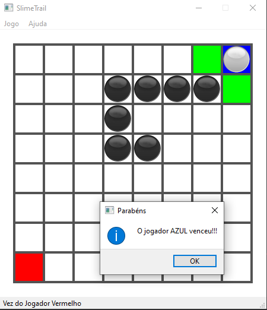

<h1 align="center"> Rastros</h1

Desenvolvido por: 

- Pablo Vasconcelos da Cruz
- Pedro Costa Calazans

  

  <a href="#tela-inicial">Tela Inicial</a> •  <a href="#menu">Menu</a> •   <a href="#vencedores">Vencedores</a> •   <a href="#empate">Empate</a>

<h1 align="center">Tela Inicial</h1>

<h1 align="center">Menu</h1>

 
    
    

<h1 align="center">Vencedores</h1>

 
    
    

<h1 align="center">Empate</h1>

<a href="#rastros">Back to top</a>

